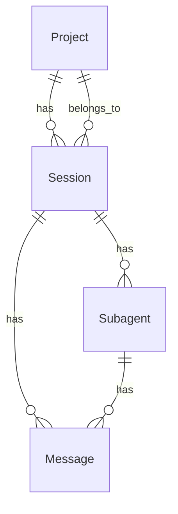
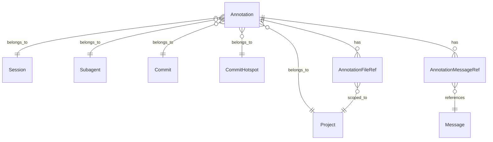
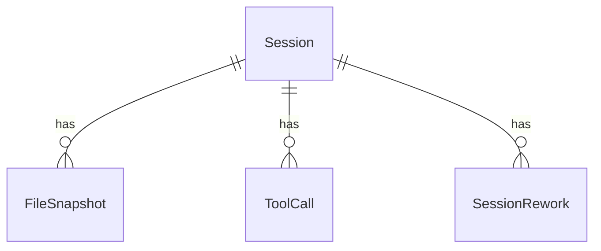
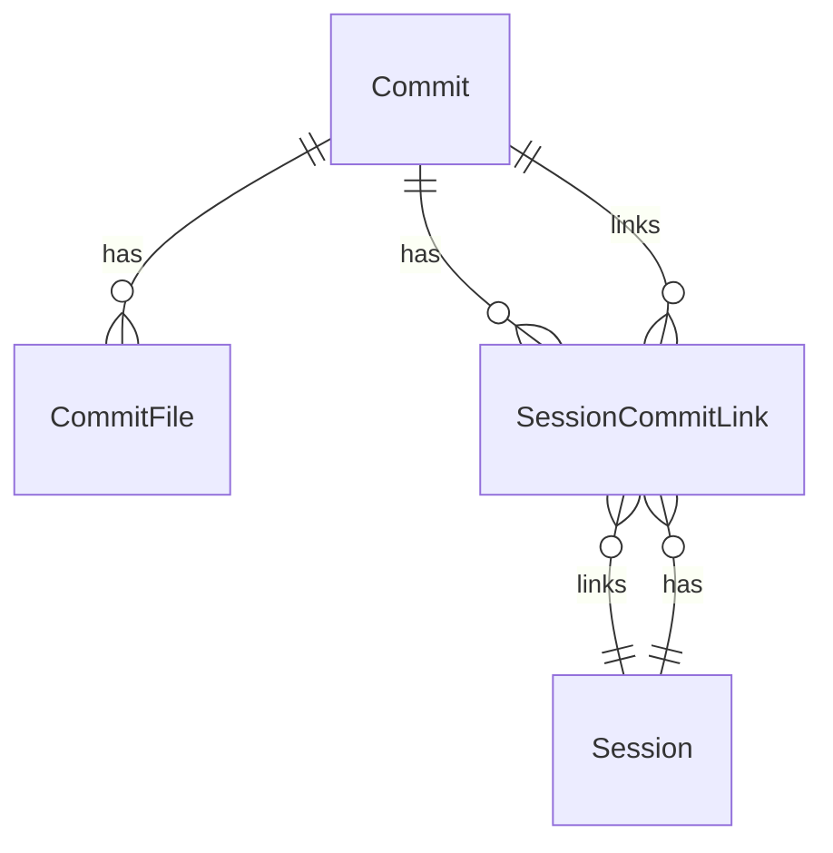
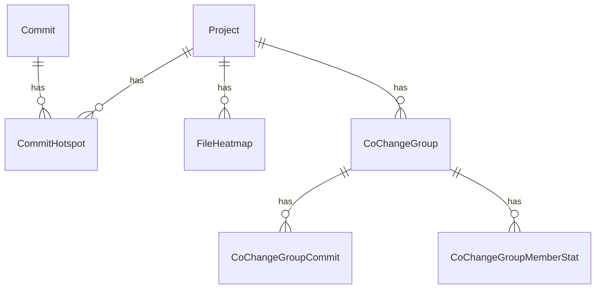
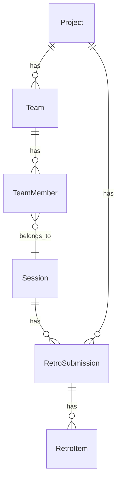
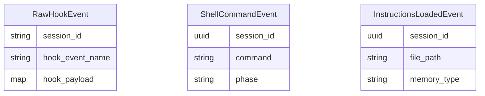
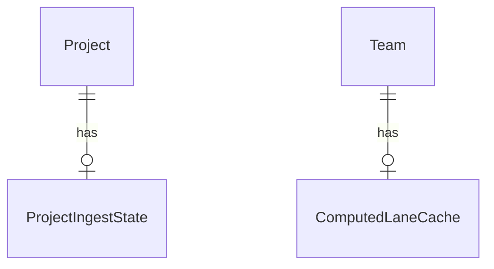
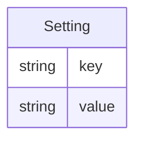
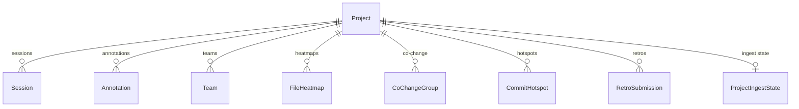

# Data Model

> Mermaid ER diagrams per resource group. See individual [feature files](features/) for how each feature uses these resources.

## Core Session Hierarchy

Project is the top-level anchor. Each project has many sessions. Sessions contain messages (the transcript) and subagents (team members). Messages can belong to either the session directly or to a subagent within the session.

## Annotations

Annotations are polymorphic — they can be attached to a session, subagent, project, commit, or hotspot (all nullable foreign keys). Each annotation tracks its `source` (where it was created) and `purpose` (review or explain). Message refs link to the transcript messages that were selected. File refs specify file paths with line ranges.

## File & Change Tracking

`FileSnapshot` captures file state before/after tool execution (content_before, content_after, change_type). `ToolCall` records each tool invocation with error status. `SessionRework` tracks files edited multiple times in a session (detected during transcript sync).

## Git Commits

`SessionCommitLink` is the join table between sessions and commits, with `link_type` (4 values: observed_in_session, descendant_of_observed, patch_match, file_overlap), `confidence` (0.0-1.0), and `evidence` (map). Upserted on `{session_id, commit_id}` identity to prevent duplicates.

## Code Analysis

`CommitHotspot` marks code regions with repeated changes, scored 0-100. `FileHeatmap` tracks per-file change frequency over a rolling window. `CoChangeGroup` identifies files that change together, with member stats (size, LOC) and individual commit records.

## Team & Retrospectives

Teams group sessions by team name. Each team member links to a session. Retrospective submissions belong to both a session and a project, containing categorized items with ratings.

## Events & Telemetry

`RawHookEvent` stores complete hook payloads as received. `ShellCommandEvent` and `InstructionsLoadedEvent` are extracted from raw events by dedicated extractors. These are standalone resources (no foreign key relationships to other tables) — linked to sessions via `session_id` UUID matching.

## Internal State

`ProjectIngestState` tracks last-run timestamps for commit ingestion, heatmap, and co-change computation (prevents redundant recomputation). `ComputedLaneCache` stores pre-computed parallel lane payloads as Erlang binary terms per team.

## Config Domain

`Spotter.Config.Setting` — simple key-value store for runtime configuration. Currently supports `transcripts_dir` key. Separate Ash domain (`Spotter.Config`).

## Cross-Domain Relationships

Project is the top-level anchor connecting all major resource groups:

